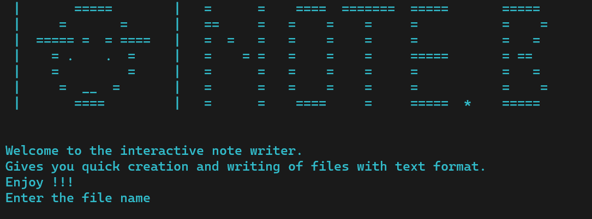

# The Hatman NoteBook Writer 
<!--  -->
A CLI based application for quick creation and writing to files.


<!-- TABLE OF CONTENTS -->
<details open="open">
  <summary>Table of Contents</summary>
  <ol>
    <li>
      <a href="#about-the-project">About The Project</a>
      <ul>
        <li><a href="#built-with">Built With</a></li>
      </ul>
    </li>
    <li>
      <a href="#getting-started">Getting Started</a>
      <ul>
          <li><a href="#prerequisites">Prerequisites</a></li>
       </ul>
    </li>
        <li>
      <a href="#usage">Usage</a>
         </li>
        <li>
      <a href="#contributing">Contibutions</a>
         </li>
           <li>
      <a href="#license">License</a>
         </li>
            <li>
      <a href="#contact">Contact</a>
         </li>
            <li>
      <a href="#acknowledgements">Acknowledgement</a>
         </li>

  </ol>
</details>


<!-- ABOUT THE PROJECT -->
## About The Project


HatMan NoteBook Writer is a simple Command Line based application.
Hatman can come in handy if you want a quick way to create .txt, .csv, files and other text format files.

Scripts and short programs in programming languages can be created and written to using hatman without worry of slow IDE problems and others.

### Built With

This simple application is built completely with python.
All the libraries utilized are available in the standard libraries.
Hatman leverages the power of python's <strong>os</strong> module.
* [Python](https://python.org)


<!-- GETTING STARTED -->
## Getting Started
1. Download the <strong>hatman.py</strong> script
2. Open your prefered command line (bash, terminal, cmd, powershell, etc.)
3. Change directory into the location you stored the script.
4. Run the script with python

### Prerequisites
You should have **`python`** installed on your machine to be able to use this application.

<!-- USAGE EXAMPLES -->
## Usage

* python shell
  ```py
  python hatman.py
  ```


<!-- CONTRIBUTING -->
## Contributing

Contributions are what make the open source community such an amazing place to be, learn, inspire, and create. Any contributions you make are **greatly appreciated**.

1. Fork the Project
2. Create your Feature Branch (`git checkout -b feature/AmazingFeature`)
3. Commit your Changes (`git commit -m 'Add some AmazingFeature'`)
4. Push to the Branch (`git push origin feature/AmazingFeature`)
5. Open a Pull Request


<!-- LICENSE -->
## License

Distributed under the MIT License. See `LICENSE` for more information.


<!-- CONTACT -->
## Contact
<li>Email: owusuwilson980@gmail.com</li>
<li>Project Link: [https://github.com/Owusu-Wilson/Hatman]</li>


<!-- ACKNOWLEDGEMENTS -->
## Acknowledgements
<ul>
<li>[Choose an Open Source License](https://MITlicense.com) </li>
<li>[GitHub Pages](https://pages.github.com)</li>
</ul>

